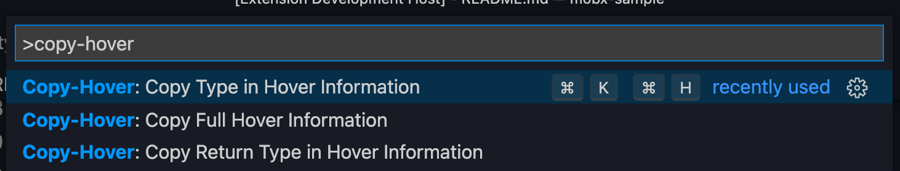

# Copy Hover Type

Very simple vscode extension for hover information.  
You can copy type in hover information

## Usage

1. Cursor at a word and type `cmd+k cmd+h(mac)` or `ctrl+k ctrl+h(window or linux))`
2. Just paste by `cmd+v`

## Quick pick

You can also choose a command in quick pick.  
Copy Full Hover Information is all information in hover.  
Copy Type in Hover Information is type information in hover.  
Copy Return Type in Hover Information is return type information in hover.

This is very simple extension, so it doesn't work properly in complex types.
